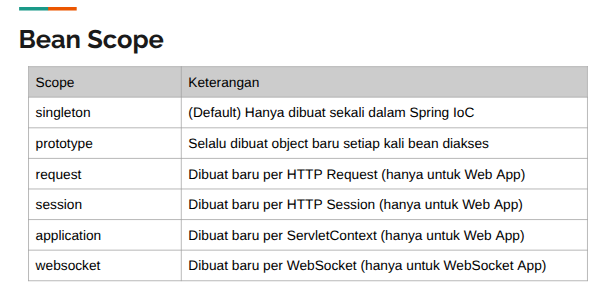
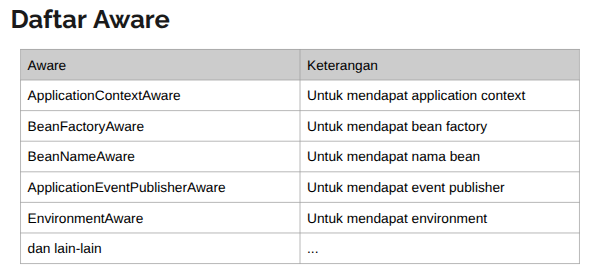
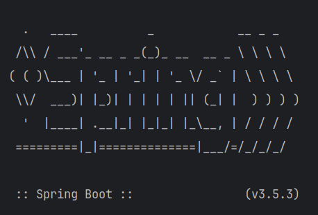
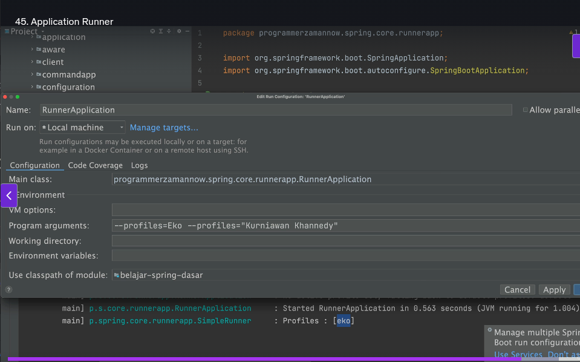
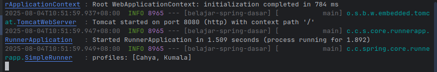

# Spring FrameWork

#### Pengenalan Spring Framework

1. @Slf4j ->
    - Annotation Lombok untuk membuat logger, sehingga kita tidak perlu membuat logger secara manual.
    - Contoh: class HelloWorld, kita membuat log dengan menggunakan @Slf4j.
2. https://docs.google.com/presentation/d/1I50ccViLOjUh9oMipLfPpsWWqKuoszhN4tDJ4xBJw5U/edit?slide=id.gedae03d015_0_931#slide=id.gedae03d015_0_931
3. Dengan @Data bisa langsung panggil setter dan getter-nya, tanpa perlu membuatnya secara manual.

```
Spring Framework adalah framework paling populer di Java, bahkan sampai mengalahkan Java Enterprise sendiri. Spring frame work dibuat sekitar tahun 2003 oleh Rod Johnson, dibuat sebagai alternatif Java Enterprise, karena sangat ringan.
```

> Websitenya -> https://spring.io/

## Spring Framework VS dengan Spring Boot

> Apa perbedaan spring Frame work dengan Spring Boot?

```
1. Spring Boot adalah "alat akselerator" yang dibangun di atas Spring Framework. Jadi Spring boot adalah layer diatasnya lagi. Spring Boot merupakan framework untuk mempermudah pembuatan aplikasi Spring Framework.

2. Spring Framework lebih ribet apalagi harus dibuat manual, jadi di buatlah Spring Boot.
```

> Kenapa menggunakan Spring?

```
Spring satu-satunya Framework paling populer di Java, bahkan banyak perusahaan pindah ke JVM karena ingin menggunakan Spring-nya (bukan karena Java-nya).
Dengan banyaknya bahasa seperti Kotlin, Groovy dan Scala, memberikan pilihan kepada programmer ketika menggunakan Spring. Contohnya netflix bikin Framework sendiri pakai Java, sekarang sudah pakai spring.
```

## Inversion of Control (IoC)

```
Merupakan prinsip dalam pembuatan kode perangkat lunak, dimana kita melakukan pemindahan kontrol untuk objek atau program ke sebuah container di framework. 

Tidak seperti biasa kita melakukan semua secara manual seperti mengeksekusi sebuah program, memanggil sebuah function. 
Dalam IoC kita dapat menyerahkan banyak perkerjaan ke container IoC.

Spring Inversion of Control-IoC:
- Kita bisa menyerahkan banyak pekerjaan dalam program kita ke Spring.
- Kode program akan mengikuti cara kerja Spring.
```

## Application Context

```
Application Context adalah sebuah INTERFACE representasi container IoC di Spring. Ini adalah inti dari Spring Framework.
```

> Contoh: fodlder test -> class ApplicationContextText.java, kita membuat ApplicationContext dengan menggunakan class
> AnnotationConfigApplicationContext.

## Congiguration - untuk membuat ApplicationContext

```

1. Untuk membuat ApplicationContext menggunakan Annotation, pertama perlu membuat Configuration class.
2. Configuration Class adalah sebuah class yang terdapat annotation @Configuration pada class tersebut.
   Contoh dan penjelasan-nya tentang membuat class configuration nama filenya (classnya) HelloWordConfiguration.
   Kemudian di panggil pada class ApplicationContextText.

```

## Singleton

```

Singleton adalah Desain Pattern untuk pembuatan objek, dimana sebuah objek hanya dibuat satu kali saja.

Jadi ketika membutuhkan object tersebut, kita hanya akan menggunakan object yang sama, sehingga selama aplikasi jalan
object hanya dibuat satu kali.

Secara default di Spring akan menggunakan Singleton.

```

> Bagaimana cara membuat Singleton di Java?

```

- Membuat class yang berisi static method untuk membuat object dirinya sendiri.
- Constructor dibuat private, agar tidak bisa diakses dari luar, sehingga user terpakasa menggunakan method static
  ketika ingin membuat objectnya.

```

> > Contohnya, di class Database dan DatabaseTest.

## Bean

```

- Bean adalah objek yang kita masukkan ke Spring Container.
- Secara default, bean merupakan singleton, artinya kalau kita mengakses bean yang sama, maka dia akan mengembalikan
  object yang sama. Kita juga bisa mengubahnya jika tidak ingin single ton.

```

> Bagaimana cara membuat bean?

```

1. Untuk membuat bean, kita dapat membuat method dalam classs Configuration
2. Nama method tersebut akan menjadi nama bean-nya.
3. Method tersebut harus memiliki annotation @Bean.

Jadi spring akan baca konfigurasi kelasnya, lalu mencari dimana ada method annotation @Bean-nya.

Cara mengakses bean-nya adalah dengan menggunakan ApplicationContext, lalu memanggil method getBean().

```

> > Contoh: class BeanConfiguration, dgn method foo() yang memiliki annotation @Bean, dan pada class BeanTest.

## Duplicate Bean

```angular2html
1. Membuat bean dengan tipe data yang sama, maka harus memberikan nama bean yang berbeda.
2. Saat mengakses bean-nya, kita harus memanggil nama bean-nya.
```

> Contoh: class DuplicateConfiguration, dengan method foo1 dan foo2 yang memiliki annotation @Bean.
> Kemudian pada class DuplicateTest, kita mengaksesnya dengan nama bean-nya.

## Primary Bean

```
Untuk mengatasi masalah duplicate bean, kita dapat menggunakan Primary Bean.
Nanti objectnya diamabil dari mana, itu adalah urusan Spring.
Spring akan secara otomatis mencari sesuai dengan tipe tersebut,
 dan otomatis akan memasukan ke si parater method-nya.

```

> > Contoh: class PrimaryConfiguration, dengan method foo1 dan foo2 yang memiliki annotation @Bean, dan method foo1
> > yang memiliki annotation @Primary.
> > Class PrimaryTest, kita mengaksesnya dengan nama bean-nya.

## Mengubah Nama Bean

```
Secara default nama bean adalah nama method-nya, kita bisa mengubahnya dengan menggunakan annotation @Bean
dan memberikan nama bean-nya.
```

> > Contoh: class BeanNameConfiguration, dengan method foo() yang memiliki annotation @Bean dan nama bean-nya "fooBean".

## Dependency Injection

```
Dependency Injection adalah proses dimana Spring akan menginjeksi bean yang dibutuhkan ke dalam class yang membutuhkannya.

Saat membuat onjek kita sering membuat object yang tergantung pada object lain.
Misalnya saya mau buat object A, tapi saya harus buat object B terlebih dahulu, karena object A tergantung pada object B.
dan B juga tergantung pada object C, dan seterusnya.

Dengan dependency, kita dapat menambahkan paremeter di method bean-nya,
nanti Spring akan mencari bean yang sesuai dengan tipe data parameter tersebut.

```

> > contoh 1: folder data -> class Foo, Barr, dan FooBar.
> > class DependencyInjectionTest, kita mengakses bean FooBar yang memiliki dependency ke Foo dan Bar.
> > contoh 2: class DependencyInjectionConfiguration, dengan method fooBar() yang memiliki parameter Foo dan Bar.
> > Class DependencyInjectionTest, kita mengaksesnya dengan nama bean-nya "fooBar".

## Memilih Dependency

```
Untuk memilih object mana yang ingin kita , terutama jika ada duplicate bean.
Kita dapat menggunakan annotation @Qualifier untuk memilih bean yang ingin kita gunakan.
@Qualifier(value = "namaBean") pada parameter method-nya.
```

> > contoh: class DependencyInjectionConfiguration, dan DependencyInjectionTest.

## Circular Dependency

```
Kasus dimana sebuah lingkaran dependency terjadi, misalnya bean A tergantung pada bean B, bean B tergantung pada bean C, 
dan ternyata C juga tergantung pada A.
Jadi jika diperhatikan ini membentuk lingkaran, sehingga akan terjadi error.

```

> > Contoh: membuat kasus circular dependency dengan membuat data class A, B, dan C pada package cyclic.
> > class CyclicConfiguration dan hasilnya pada class CyclicTest.

## Depends On

```
Saat sebuah bean membutuhkan bean lain, 
secara otomatis bean tersebut akan dibuat setelah bean yang dibutuhkan dibuat.
```

> Tapi bagaimana jika bean tersebut TIDAK membutuhkan bean lain,
> namun kita ingin bean tersebut dibuat setelah bean lain?

> > Tapi jika tidak ada saling ketergantungan, maka spring akan membuatnya secara random.
> > Untuk membuatnya kita dapat menggunakan annotation @DepenssOn pada bean yang ingin kita buat setelah bean lain.
> > @DependsOn(value = "namaBean") pada method bean-nya.

> > > Contoh:class DependsOnConfiguration dan class DependsOnTest.

## Lazy Bean

```
Secara default, bean di Spring akan dibuat ketika aplikasi Spring pertama kali dijalankan.
Jadi semua object bean akan dibuat di awal aplikasi.

TAPI jika ingin membuat sebuah lazy bean (bean tidak akan dibuat sampai dibutuhkan).
Jadi bean akan dibuat ketika bean tersebut diakses.

CARA: dengan menambahkan annotation @Lazy pada method bean-nya.
```

> Contoh: class DependsOnConfiguration, dengan method foo() yang memiliki annotation @Bean dan @Lazy.

## Scope

```
Scope adalah strategy sebuah bean (objeckt) dibuat.
Secara default, scope bean adalah singleton, artinya bean hanya dibuat satu kali saja.

Namun kita bisa mengubah scope-nya dengan menggunakan annotation @Scope(value="namaScope").
```

#### Scope Dalam Spring:


> scope prototype: bean akan dibuat setiap kali diakses.
> > contoh: class ScopeConfiguration,
> > dengan method foo() yang memiliki annotation @Bean dan @Scope(value = "prototype").
> > class ScopeTest, kita mengaksesnya dengan nama bean-nya "foo".

## Membuat Scope Sendiri

```
Kita dapat membuat scope sendiri dengan membuat class yang mengimplementasikan interface Scope.
```

> > Contoh: di package scope, class DoubletonScope yang mengimplementasikan interface Scope.
> Jadi contoh diatas:
> 1. Buat scope-nya dengan mengimplementasikan interface Scope -> class DoubletonScope.
> 2. Register scope-nya ke Spring dengan menggunakan class Configurasi -> class ScopeConfiguration.
> 3. Buat bean-nya dengan menggunakan scope yang sudah dibuat
     > -> class ScopeConfiguration, method bar() dengan annotation @Scope(value = "doubleton").
> 4. Test bean-nya dengan menggunakan class ScopeTest, kita mengaksesnya dengan nama bean-nya "bar".

## Life Cycle - Life Cycle Callback

```
Spring container memiliki siklus hidup yang mengatur bagaimana bean dibuat, diinisialisasi, digunakan, dan dihancurkan.

Life cycle callback bisa implementasikan dengan menggunakan interface InitializingBean dan DisposableBean.
- InitializingBean digunakan untuk menginisialisasi bean setelah dibuat.
- DisposableBean digunakan untuk membersihkan bean sebelum dihancurkan.
```

> > contoh: pada package data -> class Connection,
> 1. mengimplementasikan interface InitializingBean dan DisposableBean.
> 2. meregistrasikan bean-nya pada class LifeCycleConfiguration, dengan method connection() yang memiliki annotation
     @Bean.
> 3. LifeCycleTest, kita mengakses bean-nya dengan nama bean-nya "connection".

## Life Cycle Callback - Annotations

```
Selain InitializingBean dan DisposableBean, kita dapat menggunakan annotation untuk mendaftarkan callback.
Pada annotation @Bean, terdapat method initMethod dan destroyMethod.

Annotation yang dapat digunakan untuk life cycle callback:
@Bean(initMethod = "start", destroyMethod = "stop")
@PostConstruct() -> method harus dipanggil setelah bean dibuat.
@PreDestroy() -> method harus dipanggil sebelum bean dihancurkan.

```

> > Contoh: pada package data -> class Server

## Import

```
Spring mendukung import Configuration dari class lain.
Kita dapat melakukan import lebih dari satu class Configuration.
```

> > Contoh: class FooConfiguration dan BarConfiguration.
> > Kemudian pada class MainConfiguration, kita mengimport kedua class tersebut dengan menggunakan annotation @Import.

## Component Scan

```
Komponen scan adalah proses dimana Sprinh akan mencari class yang memiliki annotation
misalnya @Component, @Service, @Repository, @Controller, dan lain-lain.

Cara membuat Componen Scan adalah dengan membuat class Configuration
```

> > Contoh: class ScanConfiguration dan ScanTest.

## Component

```
Menandai class dengan annotation @Component, secara otomatis akan didaftarkan sebagai bean di Spring.
Jadi kita tidak perlu membuat method @Bean lagi.
```

> > Contoh: pada package service -> class ProductService.
> > Kemudian pada ComponentConfiguration.
> > Pada class ComponentTest.

# 3 cara melakukan dependency injection pada @Component:

## 1. Constructor-based Dependency Injection

> Bagimana jika pakai @component,
> biasanya kita untuk melakukan dependency injection di @Bean, tinggal menambahkan parameter di method-nya.
> Kemudian Spring otomatis akan mencari bean yang sesuai dengan tipe data parameter tersebut.

> > Pada @Component dapat dilakukan dengan:
> > Menggunakan construstor parameter, tapi di spring hanya mendukung satu constructor saja.
> > > Contoh1: pada package repository -> class ProductRepository,dan pada class ComponentTest.
> > > Serta constructor-based dependency injection pada class ProductService.

#### Bagimana jika ada lebih dari satu constructor?

> > > Contoh2: pada class ProductService,
> > > kita dapat menggunakan annotation @Autowired pada constructor yang ingin digunakan.
> > > Caranya tambahkan annotation @Autowired pada constructor yang ingin digunakan.

## 2. Setter-based Dependency Injection

```
Selain dengan constructor, kita juga dapat melakukan dependency injection dengan setter.
Namun kita perlu menambahkan annotation @Autowired pada setter yang ingin digunakan.
Kemudian spring otomatis mencari bean yang dibutuhkan.
Setter-based DI juga bisa digabung dengan Constructor-based DI.
```

> > > Contoh: pada package repository -> class CategoryRepository dan class componentTest.

## 3. Field-based Dependency Injection

```
Selain dengan constructor dan setter method, kita dapat melakukan dependency injection dengan field.
Caranya sama, dengan menambahkan annotation @Autowired pada fieldnya.
Ini juga bisa digabung dengan Constructor-based DI dan Setter-based DI.
Tapi field-based DI tidak disarankan karena membuat kode menjadi sulit untuk di-test.
```

> > > Contoh: pada package service -> class CustomerRepository, CustomerService dan class ComponentTest.

### Qualifier

```
Untuk mengatasi masalah duplicate bean, kita dapat menggunakan annotation @Qualifier.
Sebelum kita gunakan @qualifier utnuk memilih bean secara manual, selain dgn @Primary.

TAPI @Qualifier juga dapat digunakan pada constructor, setter, dan field.
```

> > Contoh: pada package configuration -> class CustomerConfiguration.
> > Jika ingin pakai keduanya, bisa tambahkan @Qualifier pada constructor, setter, atau field-nya (service class).
> > Cek pada CustumerService, CustomerRepository, dan class ComponentTest.
> > Sehingga pada class ComponentTest, kita harus memanggil kedua bean-nya.

## Optional Dependency - Tidak Wajib

```
Secara default, semua dependency itu wajib ada.
Kita dapat membuat optional dependency dengan menggunakan java.util.Optional.<T> 
pada parameter constructor, setter, atau field-nya.
```

> > Contoh: pada class OptionalConfiguration dan OptionalTest.

> Bagaimana jik menggunakan object provider?
> > Contoh: pada packager data -> class MultiFoo
> > Kemudian pada class ComponentConfiguration, kita harus @Import MultiFoo.class.
> > Tambahkan juga Foo lainnya pada class FooConfiguration.
> > Terakhir lakukan test pada ComponentTest.

## Factory Bean

```
Untuk mengatasi kasus dimana sebuah class bukan milik kita, misal class third-party library.
Sehingga kita tidak dapat menambahkan annotation @Component, @Service, atau @Repository.

Caranya adalah dengan membuat Factory Bean. Jadi buat annotation @Bean pada method yang mengembalikan object dari class tersebut.
```

> > Contoh: pada package client -> class PaymentGatewayClient dan FactoryTest.

## Inheritance

```
Mengakses bean dari super classnya
Mengakses bean bisa langsung dari tipe class bean-nya, atau dari superclass-nya/parent interfacenya.
```

> > contoh: pada package service, interface MerchantService dan class MerchantServiceImpl.
> > Kemudian class InheritanceTest, mengimport class MerchantServiceImpl.
> > class InheritanceTest, kita mengakses bean-nya dengan tipe MerchantService.

## Bean Factory - Listable Bean Factory

```
1. Bean Factory
ApplicationContext adalah interface turunan dari BeanFactory.
Jadi method seperti getBean() adalah method kontrak dari BeanFactory.
BeanFactory hanya bisa mengakses singleton bean saja

2. Listable Bean Factory.
Listable Bean Factory dapat mengakses beberapa bean sekaligus.
```

> > Contoh: pada class BeanFactoryTest yang mengakses class ScanConfiguration.

## Bean Post Processor

```
Bean Post Processor adalah interface yang digunakan untuk memodifikasi proses pembuatan bean di ApplicationContext.
Jadi beannya mau diapakan dulu sebelum di post.

Contoh kasus sederhana, misalnya mau membuat Bean Id Generator.
```

> > Contoh: pada package aware -> interface IdAware.

## Ordered - Pengurutan Bean Post Processor

``` 
Bean Post Processor dapat dibuat lebih dari satu.
Namun kita dapat mengatur urutan eksekusi Bean Post Processor dengan menggunakan interface Ordered.

TAPI jika ingin bean post processor-nya terurut, kita harus menggunakan interface Ordered.
```

> > Contoh, pada class IdGeneratorBeanPostProcessor tambhkan implementasi interface Ordered.
> > Misalnya bean post processor selanjutnya adalah class PrefixIdGeneratorBeanPostProcessor.
> > Ini akan dieksekusi setelah IdGeneratorBeanPostProcessor.
> > Class Test OrderedTest

## Aware adalah sebuah Interface - Super Interface

```
Sebuah interface dalam Spring bernama Aware, 
untuk penanda agar Spring melakukan injection object yang kita butuhkan.

Dengan Aware tidak perlu membuat bean Post Processor lagi.

Saat membuat bean dan ingin mendapatkan applicartion context-nya, dapat menggunakan ApplicationContextAware.
Berikut beberapa daftar Aware yang sering digunakan:
```


> > Contoh: pada package service -> class AuthService dan AwareTest.

## Bean Factory Post Processor

```
Secara default, kita tidak akan pernah membuat ApplicationContext secara manual.
Apabila kita ingin mengubah konfigurasi bean di ApplicationContext,
kita dapat menggunakan BeanFactoryPostProcessor.
```

> > Contoh: pada packager processor -> class FooBeanFactoryPostProcessor
> > yang mengimplementasikan interface BeanDefinitionRegistryPostProcessor.
> > Kemudian pada class BeanFactoryPostProcessorTest.

## Event Listener

```
Spring memiliki fitur event listener, untuk komunikai antar class menggunkan Event.
Event merupakan objek turunan dari class ApplicationEvent.
Jadi Event itu semacam data yang ditransfer ke kelas yang lain, 
sehingga harus membuat kelas turunan dari ApplicationEvent.

EVEN -> Data yang dikirimkan ke kelas lain.
LISTENER -> Kelas yang menerima event tersebut.
```

#### Dengan interface ApplicationListener

> Bagaimana cara mengirimnya?
> > Contohnya membuat Login success event pada package event -> class LoginSuccessEvent.
> > yang akan extends ApplicationEvent.
> > dan perlu data user, jadi kita perlu membuat class User pada package data.
> Lalu buat listener-nya, untuk menerima event tersebut.
> > Pada package listener -> class LoginSuccessListener.
> > Kemudian buat service untuk mengirim event tersebut -> class UserService.
> > Test pada class EventListenerTest.
>>> Keuntungan pakai listenner adalah kita bisa mengirim event ke banyak listener sekaligus.
> > > jadi tinggal ubah di testnya aja, tambahkan listener lainnya, seperti class LoginAgainSuccessEmailListener.
> > > Ini dapat dilakukan asalkan mengarah ke event yang sama, yaitu LoginSuccessEvent.
> > > Jadi caranya tinggal tambahkan saja listener-nya sehingga tidak perlu mengubah service class-nya.

## Evert Listener Annotation

#### Menggunakan annotation @EventListener

```
Pakai @EventListener vs interface ApplicationListener:
1. Jika pakai interface 1 buah bean hanya bisa mendengarkan 1 event saja.
2. Jika pakai @EventListener, kita bisa mendengarkan banyak event sekaligus.

Kesimpulan: Dengan @EventListener kita dapat membuat listenernya lebih dari 1.
```

> > Contoh: Buat sebuah bean dengan @Component,
> > misalnya pada package listener -> class UserListener.
>>> Keunggulan @ EventListener dapat dilihat pada class UserListener.

# Spring Boot (BOOT) Application

```
DENGAN SPRING BOOT, kita tidak perlu membuat ApplicationContext secara manual.
Kita akan mengganti @Configuration dengan @SpringBootApplication.

Isi dari @SpringBootApplication:
adalah gabungan dari @Configuration, @EnableAutoConfiguration, dan @ComponentScan.

SELAIN SPRING BOOT APPLICATION, untuk membuat ApplicationContext, kita tidak perlu membuat secara manual.
JADIIII bisa pakai class SpringApplication. Kenapa gak ini aja dari awal astaga, belibet keli jelasinl-nya!
SECARA OTMATIS  Spring Application akan membuat ApplicationContext, dan melakukan hal-hal yang dibutuhkan.

Caranya dengan SpringApplication.run(FooApplication.class, args);
```

> > Contoh: Membuat class FooApplication pada package application ini dengan @SpringBootApplication.
> > Kemudian buat ApplicationContext-nya dengan SpringApplication.run(FooApplication.class, args);
> Bagaimana kalau mai membuat unit test-nya?
> > Caranya dengan mengggunakan @SpringBootTest pada class FooApplicationTest.

## Startup Failure

```
Spring Boot memiliki fitur FailureAnalyzer, 
ini digunakan untuk melakukan analisa ketika terjadi error startup yang menyebabkan aplikasi tidak mau berjalan.
```

> > Contohnya: package application -> class FooApplication, kita akan tambahkan parameter bar di foo constructor-nya.
> > Test running - bandingkan errornya jika menggunakan spring boot.
> > 1. Tanpa Spring Boot, akan terjadi error karena tidak ada bean bar ->
       > > jadi bikin application manual -> package application -> class WithoutSpringBootTest.
> > 2. Dengan Spring Boot, pada class FooApplicationTest (ini lengkap dan memudahkan kita untuk mengetahui errornya).

## Banner - Tidak penting tapi menarik

```
Banner adalah tampilan tulisan yang muncul di console ketika aplikasi Spring Boot berjalan.
Secara default, banner akan menyala dan mencari tulisan banner di classpath dengan nama banner.txt.
Berikut adalah bannernya:
```


> Ini untuk generate banner-nya -> https://www.bagill.com/ascii-sig.php
> Setelah generate, copy saja ke file banner.txt di src/main/resources.
> Nah di dalamnya buat file banner.txt, isi dengan tulisan yang diinginkan.
> Lalu coba lagi run FooApplicationTest, maka banner akan muncul di console.

## Customizing Spring Apllication

```
Untuk melakukan pengaturan pada Spring sebelum Application Contextnya dibuat.
Jadi kalau mau melakukan customizing Spring Application, buat spring application-nya secara manual.
```

> > Contoh: pada package application -> class FooApplication.
> > kita komen dulu baris method main sebelumnya.

## Spring Application Event - Pada Spring Boot

```
Untuk menambahkan Listener
- Beberapa Event di Spring Boot Application Event di trigger bahkan sebelum Application Context dibuat.
- Oleh karena itu, jika menggunakan bean, bisa saja beberapa listener tidak akan dipanggil, karena belum dibuat.
- Agar lebih aman, kita bisa menambahkan listenernya menggunakan SpringApplication.addListener.
```

> > Contoh: pada package listener -> Class AppStartListener yang mengimplementasikan interface ApplicationListener.
> > Kemudian pada class FooApplication, kita tambahkan listener-nya dengan SpringApplication.addListener(new
> > AppStartListener()).
> > Lalu running saja mainnya.

## Command Line Runner

```
Saat membuat aplikasi, kadang kita perlu argument yang diberikan pada main method.
Spring Application bisa mengirimkan argument tersebut secara otomatis ke bean yang kita buat.
Kita hanya perlu membuat bean dari interface CommandLineRunner.
```

> > Contoh:pada package commandapp -> class CommandApplication, kita buat class yang mengimplementasikan interface
> > CommandLineRunner.
> > Hasilnya adalah ARRAY -> String[] args yang berisi argument yang diberikan pada main method.

## Application Runner

```
Penggunaan Application Runner sama dengan Command Line Runner, yang membedakan adalah objectnya.

1. Command Line Runner mengirimkan argument dalam bentuk String[] args.
2. Application Runner sudah di wrap dalam sebuah object ApplicationArguments.
```

> > Contoh: pada package runnerapp -> class RunnerApplication dan class SimpleRunner.
> > cara menambhakan datanya:
> > Jadi --Profle= cahya misalnya.



## Spring Boot Plugin

```
Plugin untuk mempermudah saat kita menjalankan aplikasi Spring, dengan perintah:
mvn spring-boot:run.
TAPI ini wajib ada 1 main class saja.
sehingga main method di class lain akan saya komen dulu.
```

> Caranya running dengan perintah:
> mvn spring-boot:run

#### Distribution File

```
Spring boot plugin juga dapat digunakan untuk membuat distribution file applikasi kita.
Plugin ini akan mendeteksi main class di project kita, 
lalu membundle aplikasi beserta dependency yang dibutuhkan dalam satu file JAR.
Pastikan hanya terdapat 1 main class saja di project kita.
```

> Caranya running dengan perintah:
> > mvn package
> Jadi nanti dia akan masuk ke dalam folder target.
> dan disana akan ada file JAR yang sudah dibundle dengan dependency-nya.
>
> > atau kalau tidak mau isi test (hanya inging membuat file jar nya) run => mvn clean package -DskipTests
> > Cek pada package target, akan ada file JAR yang sudah dibundle dengan dependency-nya,
> > yakni belajar-spring-boot-0.0.1-SNAPSHOT.jar.
> > Sehingga kita dapat running dengan perintah:
> > java -jar target/belajar-spring-boot-0.0.1-SNAPSHOT.jar
> > dan kita bisa isi langsung value-nya di command line, misalnya:
> > java -jar target/belajar-spring-boot-0.0.1-SNAPSHOT.jar --profiles=cahya --profiles=kumala

Hasilnya adalah:
